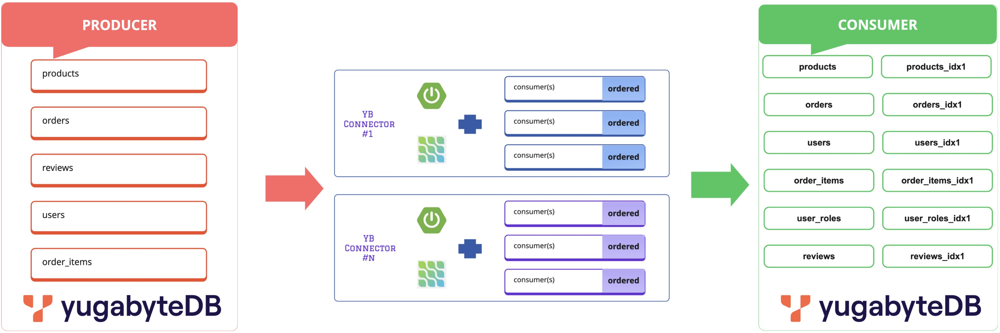

# spring-boot-cdc-stream
[Spring Boot](https://spring.io/projects/spring-boot) and embedded [debezium](https://debezium.io/) based CDC solution for [postgres](https://www.postgresql.org/docs/) and [yugabytedb](https://docs.yugabyte.com/)

Implementing CDC using Spring Boot, Debezium's embedded engine, and YugabyteDB offers a compelling strategy for real-time data synchronization without the complexities of a dedicated middleware like Kafka. This approach provides several key advantages, including simplicity in architecture and deployment, reduced operational overhead, direct integration of change events within the application logic, and the ability to leverage YugabyteDB's strong compatibility with PostgreSQL. The PostgreSQL compatibility of YugabyteDB plays a crucial role in making this approach accessible and efficient for a lot of tools to easily integrate with YugabyteDB if they already support PostgreSQL as a source or target. It is important to emphasize that while this middleware-less approach offers considerable benefits for specific use cases, the optimal choice of CDC strategy should always be driven by the particular requirements of the application. Factors such as the need for high scalability, robust fault tolerance, broad event distribution, and integration with a diverse range of external systems will influence whether this direct integration is the most suitable solution. However, for scenarios prioritizing simplicity, low latency, and reduced operational complexity, this combination presents a powerful and efficient way to achieve real-time data synchronization.



## Prerequisites
Before you begin, ensure you have the following installed:
- Java Development Kit (JDK) 21 or higher: [Download JDK](https://sdkman.io/jdks)
- Apache Maven: [Download Maven](https://maven.apache.org/download.cgi)
- Git: [Install Git](https://git-scm.com/downloads)
- YugabyteDB: [Install YugabyteDB](https://docs.yugabyte.com/stable/reference/configuration/yugabyted/)
- YugabyteDB Debezium [Connector](https://github.com/yugabyte/debezium/releases/tag/dz.2.5.2.yb.2024.2.3)

## Get Started
You can find the complete source at [GitHub](https://github.com/srinivasa-vasu/spring-boot-cdc-stream.git). 

## Step 1: Clone the Repository

```sh
git clone [REPO]

cd spring-boot-cdc-stream
```

## Step 2: Install YBDB Debezium connector

```sh
# download the ybdb connector jar
wget https://github.com/yugabyte/debezium/releases/download/dz.2.5.2.yb.2024.2.3/debezium-connector-yugabytedb-dz.2.5.2.yb.2024.2.3-jar-with-dependencies.jar

# create ybdb pom
cat > debezium-yugabyte-2.5.2.Final.pom << EOF
<project xmlns="http://maven.apache.org/POM/4.0.0" 
         xmlns:xsi="http://www.w3.org/2001/XMLSchema-instance"
         xsi:schemaLocation="http://maven.apache.org/POM/4.0.0 
                             http://maven.apache.org/xsd/maven-4.0.0.xsd">
    <modelVersion>4.0.0</modelVersion>
    <groupId>io.debezium</groupId>
    <artifactId>debezium-yugabyte</artifactId>
    <version>2.5.2.Final</version>
    <description>YugabyteDB Debezium Connector</description>
    <packaging>jar</packaging>
</project>
EOF

# install connector to the local repo
mvn install:install-file \
  -Dfile=debezium-connector-yugabytedb-dz.2.5.2.yb.2024.2.3-jar-with-dependencies.jar \
  -DpomFile=debezium-yugabyte-2.5.2.Final.pom \
  -DgroupId=io.debezium \
  -DartifactId=debezium-yugabyte \
  -Dversion=2.5.2.Final \
  -Dpackaging=jar

```

## Step 3: Configure the Application

Update the `application-[profile].yml` file located in `src/main/resources/` with producer, consumer and datasource connection details.

## Step 4: Build and Run the Application
```sh
mvn -DskipTests -Dspring-boot.run.profiles=[REPLACE_PROFILE] clean install

mvn -DskipTests -Dspring-boot.run.profiles=[REPLACE_PROFILE] spring-boot:run 
```

## Step 5: Verify CDC Functionality

To test the CDC pipeline:
- Insert or update data in the source database.


