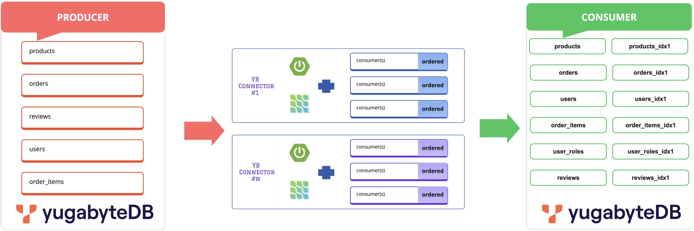

# spring-boot-cdc-stream
[Spring Boot](https://spring.io/projects/spring-boot) and embedded [debezium](https://debezium.io/) based CDC solution for [postgres](https://www.postgresql.org/docs/) and [yugabytedb](https://docs.yugabyte.com/)

Implementing CDC using Spring Boot, Debezium's embedded engine, and YugabyteDB offers a compelling strategy for real-time data synchronization without the complexities of a dedicated middleware like Kafka. This approach provides several key advantages, including simplicity in architecture and deployment, reduced operational overhead, direct integration of change events within the application logic, and the ability to leverage YugabyteDB's strong compatibility with PostgreSQL. The PostgreSQL compatibility of YugabyteDB plays a crucial role in making this approach accessible and efficient for a lot of tools to easily integrate with YugabyteDB if they already support PostgreSQL as a source or target. It is important to emphasize that while this middleware-less approach offers considerable benefits for specific use cases, the optimal choice of CDC strategy should always be driven by the particular requirements of the application. Factors such as the need for high scalability, robust fault tolerance, broad event distribution, and integration with a diverse range of external systems will influence whether this direct integration is the most suitable solution. However, for scenarios prioritizing simplicity, low latency, and reduced operational complexity, this combination presents a powerful and efficient way to achieve real-time data synchronization.



## Prerequisites
- Java Development Kit (JDK) 21 or higher: [Download JDK](https://sdkman.io/jdks)
- Apache Maven: [Download Maven](https://maven.apache.org/download.cgi)
- YugabyteDB: [Install YugabyteDB](https://docs.yugabyte.com/stable/reference/configuration/yugabyted/)
- A Kafka cluster and a Kafka Connect worker
- YugabyteDB Debezium [Connector](https://github.com/yugabyte/debezium/releases), installed
  into the **Connect worker** — this application no longer embeds it

## Architecture

The source half runs in Kafka Connect; this application is the sink half only.

```
YugabyteDB ──▶ Kafka Connect ──▶ Kafka topics ──▶ this app ──▶ YugabyteDB
  (source)     (YB connector)                     (apply)        (sink)
```

Connect owns the replication slot, the publication and its own offsets. This application
consumes topics and applies rows, and holds no source-side configuration at all.

## Step 1: Configure the connector

Publish per-table topics as `<prefix>.<schema>.<table>`, with a converter that keeps the
Connect schema on the wire:

```properties
value.converter=org.apache.kafka.connect.json.JsonConverter
value.converter.schemas.enable=true
key.converter=org.apache.kafka.connect.json.JsonConverter
key.converter.schemas.enable=true
provide.transaction.metadata=true
```

Or Avro against a registry:

```properties
value.converter=io.confluent.connect.avro.AvroConverter
value.converter.schema.registry.url=http://localhost:8081
key.converter=io.confluent.connect.avro.AvroConverter
key.converter.schema.registry.url=http://localhost:8081
```

A schema must arrive either way. The apply side derives sink types from it — `TypeMapper`
dispatches on Debezium logical names like `io.debezium.time.MicroTimestamp`, and
`RecordConverter` needs it to spot the `yboutput` `{value, set}` column envelope. Both
converters preserve those names: JSON carries them inline, Avro round-trips them through
`connect.name`. Schemaless JSON is the one option that cannot work.

## Step 2: Configure this application

Edit `src/main/resources/application-[profile].yml`: the sink datasource under `spring`,
ingestion under `kafka`, and apply behaviour under `consumer`.

## Step 3: Build and run

```sh
mvn -DskipTests -Dspring-boot.run.profiles=[REPLACE_PROFILE] clean install

mvn -DskipTests -Dspring-boot.run.profiles=[REPLACE_PROFILE] spring-boot:run
```

The sink tables must already exist with a primary key or unique constraint on the same key
columns — this pipeline issues no DDL. `SinkPrecondition` checks that up front and names
what is missing.

## How the apply side works

Changes are applied by a schema-driven path with no per-table queues and no worker pool.
Order comes from the transport, not from re-sorting: Kafka preserves it per partition, and
the apply side never reorders what it receives. Statements are generated from each record's
own Connect schema and cached, which is what allows a new source column to flow through
without a code change.

Throughput comes from batching and coarser commits, not parallelism. Adjacent rows that
share a statement are coalesced into one JDBC batch — never reordered — and
`consumer.transactions-per-commit` groups several adjacent source transactions into one sink
commit.

### Commit granularity

`consumer.transaction-scope` selects what commits as one sink transaction:

| | `none` | `table` | `global` |
|---|---|---|---|
| Source order | preserved | preserved | preserved |
| Commit unit | `batch-size` rows | one transaction's changes to one table | one whole source transaction |
| Partial transaction visible in the sink? | yes | per table only | **no** |
| Needs BEGIN/END markers | no | no | **yes** |

`global` buffers until the transaction's END marker, so a reader never observes half a
source transaction. A transaction spanning several delivery batches stays buffered and is
never acknowledged, so an incomplete one is re-delivered rather than half-applied. The
initial snapshot emits no markers and falls back to size-based flushing.

`table` needs no markers at all — every row carries its own `txId`, so a change of
transaction or of table ends the unit. A transaction touching three tables becomes three
sink transactions, each atomic. This exists because it is the strongest guarantee ordinary
per-table Kafka topics can support.

Offsets advance only after the rows have committed. Alongside them an LSN watermark is
written to `consumer.apply-state-table` **inside the same transaction as the rows**, so a
replay after a crash is recognisable — Debezium's own offset store is flushed asynchronously
and always lags the apply.

### Ingestion and ordering

**Ordering is a property of the topology, not of the consumer.** Kafka gives per-partition
order and nothing more, so which `transaction-scope` values are actually available depends
on how the connector publishes:

| Topology | Supported scope |
|---|---|
| Per-table topics (Debezium default) | `none`, `table` |
| All tables **and** the transaction topic funnelled into one single-partition topic | `none`, `table`, `global` |

The funnel is a `ByLogicalTableRouter` SMT with `topic.regex: (.*)`. Transaction markers
survive it — the SMT reroutes non-envelope records with their value untouched — which is
what puts BEGIN/data/END back into one ordered stream. Create the target topic with
`partitions=1`, and either leave the producer idempotent (the Kafka 3.x default) or set
`max.in.flight.requests.per.connection=1`, or a retry reorders within the partition and
nothing tells you.

A single partition costs less than it looks: `ChangeEventApplier` is single-threaded by
design, so the applier is already the ceiling.

**Offsets are stored in the sink.** `KafkaOffsetStore` writes `(consumer_group, topic,
partition, offset)` inside the row transaction, and the consumer seeks to that on
assignment rather than trusting Kafka's committed offset. The sink therefore cannot
disagree with its own progress record, and replay after a crash or rebalance is bounded and
exact. This is a better restart key than the LSN watermark beside it — a topic offset has
none of the slot-recreation hazards that make `skip-applied-lsn` unsafe to enable.

**Both JSON and Avro are supported**, selected by `kafka.converter`. The format never
reaches the apply side — both yield a Connect `Struct` and `Schema`, and everything below
the converter works off that — so the choice is about the wire, not correctness:

| | JSON + `schemas.enable=true` | Avro + registry |
|---|---|---|
| Payload | Whole schema in **every message**, commonly 5–10× on a wide table | 5-byte header + compact binary |
| Effective batch | Fat records may not fill `max-poll-records` within `max.partition.fetch.bytes`, so commit units shrink | 500 records fits comfortably |
| Incompatible source change | Surfaces late, as a halted pipeline from `SinkPrecondition` | Rejected at the connector, before publish |
| Operational | No registry to run or depend on | Registry must be up to produce and consume |

Avro is not bundled by default — its dependency tree is large and a JSON deployment has no
use for it. Build with `-Pavro` and set `kafka.converter: avro` plus
`kafka.schema-registry-url`. `ConverterFactory` loads converters by class name the way
Connect does, so any other `Converter` implementation can be named directly, with
`kafka.converter-properties` passed through for registry credentials and subject-naming
strategies.

**Topics can be discovered dynamically.** Subscription is always by pattern, so
`kafka.topic-pattern: "ybdb\\.public\\..*"` picks up a newly captured table without a
restart — Debezium names per-table topics `<prefix>.<schema>.<table>`. Anchor it at the
schema: a bare `ybdb\..*` would also pull in `ybdb.transaction`, whose markers mean nothing
once partitions are not co-ordered. Discovery costs a metadata refresh
(`kafka.metadata-max-age-ms`, five minutes by default) and triggers a rebalance, so it is
eventual rather than immediate. An explicit `kafka.topics` list still works and is quoted
into an equivalent exact pattern.

**Replication origins are named per lane.** `consumer.apply-origin-name` is a *prefix*:
`OriginNames` composes `<prefix>_<slot-or-consumer-group>_<lane>`, so a single-lane pipeline
claims `cdc_apply_ybdb_1`. The pipeline component stops two deployments sharing a sink from
colliding, and the lane component is what parallel apply will need — origins are held by one
session at a time, so each lane needs its own. The names are derived rather than random, so
a restart reuses the origins it already registered instead of leaking a permanent catalog
row each time. On the read side `consumer.ignore-origins` matches **prefixes**, so naming
the family `cdc_apply_ybdb` once covers every lane the peer runs.

**Parallel apply, for `table` scope only.** `kafka.concurrency` gives each listener thread
its own *apply lane*: a pool of exactly one connection, its own replication origin, and its
own transaction. One connection per lane rather than one pool of N is forced by how the
origin is claimed — Hikari's `connectionInitSql` is a single static string, so every
connection in a pool would claim the same origin and only the first could succeed.

Lanes are rejected with `global` scope, where one partition means one thread could ever
hold an assignment anyway, and with `skip-applied-lsn`, whose single-row watermark no longer
describes independently advancing lanes. With more than one lane the LSN watermark is not
written at all; the per-partition Kafka offsets carry restart state, and they are already
keyed per partition so lanes never contend.

What you give up is cross-table ordering. Each table stays ordered within its partition, and
that is what `table` scope already concedes.

**Deployment.** With `concurrency: 1` a single partition means one consumer holds the
assignment, so run `replicas: 1` with `strategy: Recreate` — a rolling update starts the new
pod before the old one exits and the two fight over the replication origin. Scaling out is
via lanes inside one instance, not more instances.

### Schema changes are not replicated

This pipeline replicates **data**. It issues no DDL against the sink, ever, and the sink's
schema is expected to be managed out of band — by your migration tool, or by whoever owns the
target. Source and sink must be migrated in a compatible order: add the column to the sink
before the source starts sending it.

That is a deliberate boundary rather than a missing feature. PostgreSQL and YugabyteDB
logical decoding emit no DDL events, so the only way to infer a schema change here is to diff
each change event's Connect schema against the sink — an inference that cannot tell a rename
from a drop plus an add, cannot backfill a new column with the source's default, and would be
reshaping tables this pipeline does not own.

What it does do, once per table per distinct schema shape, is verify read-only that the sink
can accept the rows, before any are written:

| Checked | Why it is worth failing early |
|---|---|
| Table exists | otherwise `42P01`, from deep inside the first batch |
| Every event column exists in the sink | otherwise a column silently absent from the write |
| Sink column can store the incoming values | otherwise truncation or out-of-range, thousands of rows in |
| A unique constraint matches the key columns | otherwise `42P10` — reported as a syntax-class error against SQL that is well formed |

Spring folds the SQLSTATE cases into `BadSqlGrammarException`, so the generated SQL rarely
identifies the cause on its own. Failing up front names the table, the columns, and what to
do. A sink column that is deliberately *wider* than the source is fine and is not reported.

The check is not retryable — no amount of waiting adds a missing column — so it halts the
pipeline with `UnrecoverableApplyException` rather than burning through the backoff.

### Adding a table to the capture set

Only **streaming** works for a table added later. An existing slot will start delivering
changes to the new table, but it will never backfill the rows already in it, and neither
mechanism Debezium normally offers for that works against YugabyteDB logical replication:

- **`snapshot-mode: initial` does not help.** The snapshot is taken once, when the
  replication slot is created, and establishes that slot's consistent point. A table added to
  `table.include.list` afterwards is past that point, and offsets already exist, so nothing
  re-snapshots.
- **`signal.data.collection` does not work.** Incremental snapshots driven by a signalling
  table are not supported here, so `producer.signal-data-collection` will not backfill the
  table however it is configured.

To pick up a table that has no pre-existing rows:

1. Add it to `producer.table-list` and **restart** — Debezium reconciles the publication at
   connector startup only. 
2. Create the table in the **sink** first, with a primary key or unique constraint on the same
   key columns. This pipeline issues no DDL, so `SinkPrecondition` halts on the table's first
   event otherwise.

To backfill a table that already holds rows, run a **separate replication slot** — creating a
slot is what establishes a new consistent snapshot point, so a second deployment gets one:

1. Add the table to the main pipeline's `table-list` and restart it, so streaming for that
   table begins. Do this **first**.
2. Then start a second deployment with its own `replication-slot`, `publication-name` and
   `offset-storage-jdbc-table`, a `table-list` containing only the new table, and
   `snapshot-mode: initial`. Its slot creation snapshots the existing rows, after which it
   streams.
3. Once it has caught up, retire it. The main pipeline carries the table from then on.

The order matters. Starting the backfill slot first leaves a window between its snapshot point
and the main pipeline picking up the table, and changes in that window are lost. The order
above overlaps the two instead — and overlap is harmless, because every statement this
pipeline generates is idempotent (upsert by key, delete by key), so the same row applied twice
converges on the same state.
